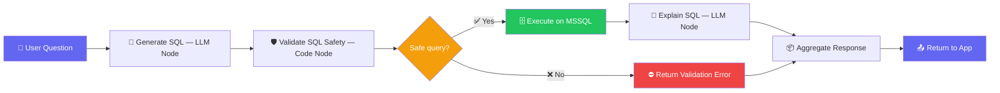
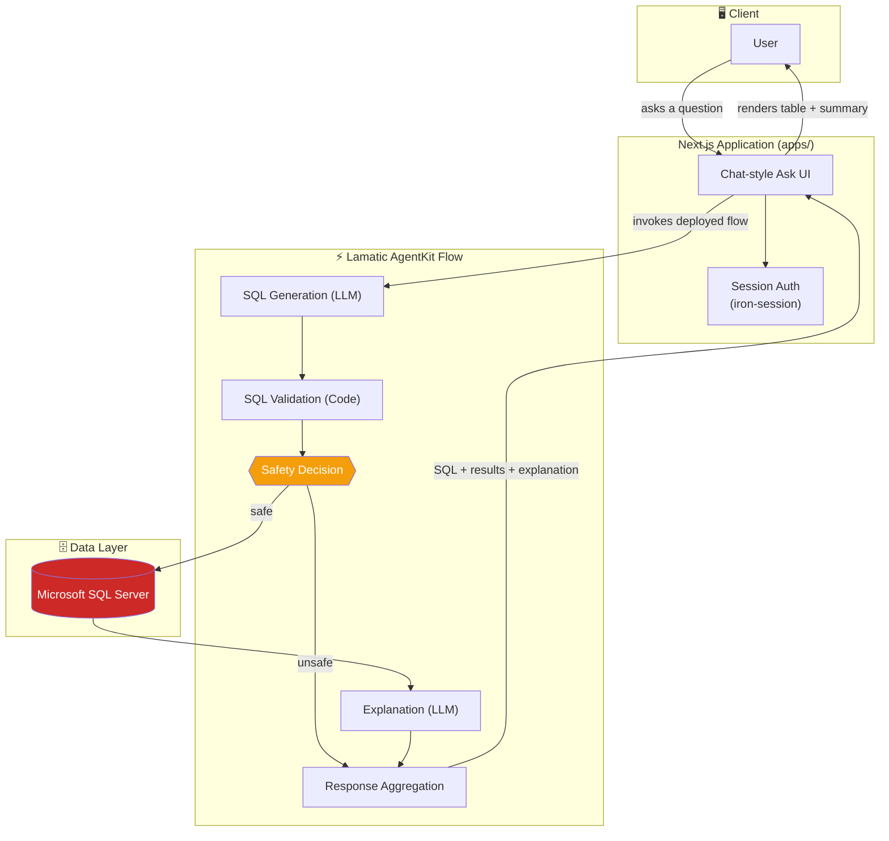
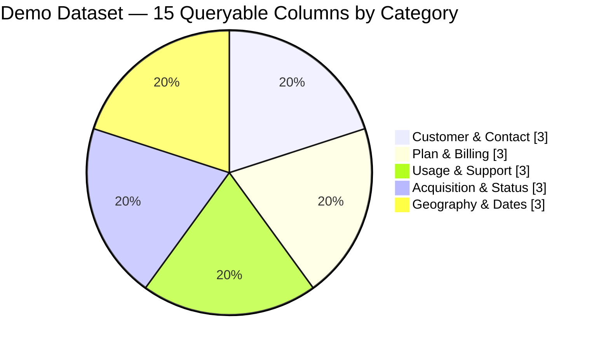
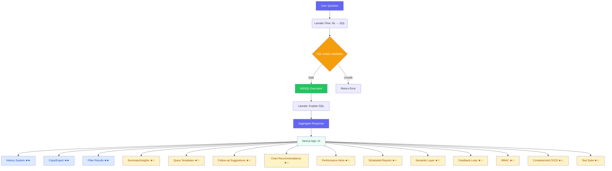

<div align="center">

# 🗄️ Queryline
### Natural Language → Safe, Read-Only SQL for Microsoft SQL Server

Ask your database a question in plain English. Get back a validated `SELECT` query, the results, and a plain-language explanation — no SQL required.

[](https://agent-kit-omega.vercel.app/login)
[](https://lamatic.ai)

<br/>

[](https://nextjs.org)
[](https://react.dev)
[](https://www.typescriptlang.org)
[](https://www.microsoft.com/en-us/sql-server)
[](https://tailwindcss.com)
[]()
[]()

</div>

---

## 📚 Table of Contents

- [Overview](#-overview)
- [The Problem](#-the-problem)
- [How It Works](#-how-it-works)
- [Architecture](#-architecture)
- [Key Features](#-key-features)
- [Demo Database](#-demo-database)
- [Tech Stack](#-tech-stack)
- [Requirements](#-requirements)
- [Environment Variables](#-environment-variables)
- [Authentication & Production Notes](#-authentication--production-notes)
- [Local Development](#-local-development)
- [Common Failure Modes](#-common-failure-modes)

---

## 🔎 Overview

**Queryline** is a Kit built on the [Lamatic AgentKit](https://lamatic.ai) platform. It pairs a Lamatic flow with a Next.js web app so analysts, operations teams, and business users can ask questions about a **Microsoft SQL Server** database without writing a single line of SQL.

Type a question → get back:

| 🧩 Output | 📄 Description |
|---|---|
| **Generated SQL** | A single T-SQL `SELECT` statement grounded in your schema |
| **Safety Check** | Automatically rejects writes, DDL, and multi-statement queries |
| **Results** | Live rows from SQL Server (only when the query is deemed safe) |
| **Explanation** | Plain-language summary of what the query actually does |

---

## 🧱 The Problem

Databases hold the answers, but not everyone who needs an answer can write SQL. A business user asking *"how many customers signed up last month?"* usually has to wait on someone with SQL skills to translate that question into a query — a slow, repetitive, and error-prone bottleneck.

**Queryline removes that bottleneck** by generating, validating, and safely executing the query for you — then explaining it back in plain English.

---

## ⚙️ How It Works



**Step-by-step:**

1. **API Request** (trigger) — receives the user's question.
2. **Generate SQL** (LLM node) — converts the question into a single T-SQL `SELECT`, grounded in the database schema.
3. **Validate SQL** (code node) — must start with `SELECT`, no multiple statements, no write/DDL keywords (`INSERT`, `UPDATE`, `DELETE`, `DROP`, `ALTER`, `CREATE`, `TRUNCATE`, `MERGE`, `CALL`). Appends `TOP 1000` if no `TOP` clause is present.
4. **Is SQL safe?** (condition node) — routes to execution or straight to an error response.
5. **Execute** (mssql node) — runs the validated query, safe branch only.
6. **Explain SQL** (LLM node) — plain-language explanation of the query.
7. **Aggregate Response** (code node) — combines SQL, explanation, safety flag, rows, row count, and any error.
8. **API Response** — structured result returned to the Next.js app.

---

## 🏗️ Architecture



| Component | Responsibility |
|---|---|
| **Next.js App** (`apps/`) | Captures the question, calls the Lamatic flow, renders SQL + explanation + results table |
| **Lamatic AgentKit Flow** (`flows/nl-to-sql-flow.ts`) | Orchestrates the full NL → SQL → validate → execute → explain pipeline |
| **Microsoft SQL Server** | The read-only database queried by the flow's `mssqlNode` |
| **Prompts / Model Configs / Constitution** | Externalized, versioned resources that drive the LLM nodes |

> **Active Lamatic Flow ID:** `0b890b4d-dd30-4f33-9663-4311c896e1b5`

---

## ✨ Key Features

| Feature | Details |
|---|---|
| 🗣️ **Natural-language SQL generation** | LLM node converts plain English into T-SQL `SELECT` statements |
| 🖥️ **Microsoft SQL Server support** | Dedicated `mssqlNode` execution, with `TOP` row limiting |
| 🛡️ **SQL safety validation** | Blocks writes, DDL, and multi-statement queries — `SELECT`-only |
| 🔒 **Read-only by design** | Anything that isn't a single `SELECT` is flagged unsafe and never runs |
| 📏 **Result-size enforcement** | Auto-adds `TOP 1000` when no limit is specified |
| 📊 **Structured results** | SQL, explanation, safety flag, rows, and row count returned together |
| 🧾 **Plain-language explanations** | Every query is explained in non-technical terms |
| 💬 **Chat-style web UI** | Next.js app with a table view for results |

---

## 🗃️ Demo Database

> This project ships wired up to a **demo telecom dataset** — **10,000 customer records across 15 columns** — so you can try it instantly without connecting your own database.



| Category | Example Columns |
|---|---|
| 👤 Customers | Name, email |
| 📦 Subscription plans | Plan type (Basic / Standard / Premium / Enterprise), channel |
| 💳 Billing | Recurring monthly fee |
| 📶 Data usage | Usage in GB |
| 🎫 Support | Number of support tickets raised |
| 🔁 Renewals | Subscription renewal date |
| 📈 Acquisition | Organic, referral, partner, direct, Google Ads, social, email |
| 🌍 Geography | City, state |
| 🔐 Payments | UPI, credit/debit card, net banking, auto debit |
| 🕒 Activity | Signup date, last login date |

Try asking:
- *"How many customers are active?"*
- *"Average data usage by plan"*
- *"Which acquisition channel brings the most Premium customers?"*

---

## 🧰 Tech Stack

| Layer | Technology |
|---|---|
| Frontend framework | Next.js `14.2.15`, React `18.3.1` |
| Language | TypeScript `5` |
| Styling | Tailwind CSS `3.4`, `class-variance-authority`, `clsx` |
| UI Components | Radix UI, `lucide-react` icons |
| Session/auth | `iron-session` |
| SQL syntax highlighting | `react-syntax-highlighter` |
| Orchestration | Lamatic AgentKit (`lamatic` SDK) |
| Database | Microsoft SQL Server |
| Testing | Playwright |

---

## ✅ Requirements

- **Node.js** — a currently supported LTS release (app uses Next.js `14.2.15` / React `18.3.1`)
- **npm** — package manager for the app
- **Lamatic account** — project, deployed flow ID, API URL, project ID, and API key
- **Microsoft SQL Server** — a read-only user + restricted-privilege database is recommended

---

## 🔑 Environment Variables

Copy `apps/.env.example` to `apps/.env.local` and fill in the values. **Never commit a real API key or credential.**

| Variable | Purpose | Example |
|---|---|---|
| `LAMATIC_API_URL` | Base URL of the Lamatic API | `https://api.lamatic.ai` |
| `LAMATIC_PROJECT_ID` | Your Lamatic project ID | `your_lamatic_project_id` |
| `LAMATIC_API_KEY` | Secret API key | `your_lamatic_api_key` |
| `NL_TO_SQL_FLOW_ID` | Deployed Queryline flow ID | `your_deployed_flow_id` |
| `SESSION_PASSWORD` | ≥32-char secret for `iron-session` cookie signing | `a_complex_password_at_least_32_chars_long!!` |
| `DEMO_USERNAME` | Demo login username | `demo` |
| `DEMO_PASSWORD` | Demo login password | `demo` |
| `MSSQL_SERVER` | SQL Server host (used by the flow, not the app) | `your_azure_sql_server.database.windows.net` |
| `MSSQL_PORT` | SQL Server port | `1433` |
| `MSSQL_DATABASE` | Database name | `your_azure_sql_database` |
| `MSSQL_USER` | SQL Server user | `your_azure_sql_user` |

> `MSSQL_*` values configure the flow's SQL Server node (credentials typically live in Lamatic Studio). An optional `MOCK_LAMATIC=true` flag returns a canned response for local front-end testing without calling Lamatic.

---

## 🔐 Authentication & Production Notes

The current login uses **static demo credentials** (`demo` / `demo`) — fine for local development, **not for production**.

**Recommended path to production:** replace it with an OTP flow built in Lamatic:

1. Build a second flow (e.g. `flows/otp-auth-flow.ts`) with an **API Request** trigger.
2. **Send code** — a Code node generates a short-lived numeric OTP; a Gmail node (`GMAIL_SEND_EMAIL`) emails it.
3. **Verify code** — a Condition node compares the submitted code, returning `{ authenticated: true|false }`.
4. Store the expected code/expiry in **Lamatic Variables & Secrets**, shorten its lifetime, invalidate on first use, and rate-limit sends.
5. Wire the app's `apps/actions/login.ts` to call the new `OTP_FLOW_ID` instead of the static check.

> Never commit real API keys or OTP secrets. Treat `SESSION_PASSWORD` as a secret.

---

## 🚀 Local Development

```bash
cd kits/nl-to-sql-agent/apps
npm install
```

Create `.env.local` from `apps/.env.example` and set your Lamatic credentials + deployed flow ID.

```bash
npm run dev
```

Open **[http://localhost:3000](http://localhost:3000)**, sign in with `demo` / `demo`, and ask something like *"Show me all users."*

| Script | Purpose |
|---|---|
| `npm run dev` | Start the development server |
| `npm run build` | Create an optimized production build |
| `npm run start` | Serve the production build |
| `npm run lint` | Run ESLint |

---

## 🩹 Common Failure Modes

| Symptom | Likely Cause | Fix |
|---|---|---|
| 401 / 403 / auth error | Missing or wrong `LAMATIC_API_KEY` | Re-copy keys from Lamatic Studio; check `LAMATIC_PROJECT_ID` matches |
| Flow not found / 404 | `NL_TO_SQL_FLOW_ID` unset or undeployed | Deploy the flow, update the env var |
| "Unsafe SQL" / blocked result | Generated SQL wasn't a single read-only `SELECT` | Rephrase the question |
| Empty explanation | Explanation LLM node failed | Check the model config; retry |
| Blank / incomplete result | Remote model processed without returning data | Resubmit the question |
| Query execution error | SQL Server connection/permission issue | Verify the connection and read access in Lamatic Studio |

---

## Further possible development

Below is a curated list of feasible enhancements that build directly on the existing Queryline (nl-to-sql-agent) foundation. These ideas leverage the already‑implemented history system, copy/export utilities, safety validation, and modular architecture—so they can be added with relatively low effort while delivering high value.

### 📊 Feature Overview

| Feature | Description | Effort | Icons |
|---|---|---|---|
| **Summary / Insights Panel** | Auto‑generate statistics (row counts, distinct values, date ranges, simple aggregations) and display them in the UI (already scaffolded, just needs data from orchestrate). | Low | 📈 📊 |
| **Query Templates (Enhanced Favorites)** | Save favorite queries as named, parameterized templates (e.g., “Show customers from `{state}` with `{plan}` plan”) with tags and sharing. | Low‑Medium | 📋 🔖 |
| **Result‑Based Follow‑up Suggestions** | After seeing results, propose natural‑language follow‑ups (“You saw high usage from Channel X—want to see trend over time?”). | Low | 💡 ➡️ |
| **Auto‑Chart Recommendations** | Analyze result set to suggest chart types (time series → line, categorical → bar, proportions → pie) and optionally render them with a lightweight charting library. | Low‑Medium | 📊 📈 |
| **Query Performance Hints** | Run an EXPLAIN plan (read‑only) on safe queries to warn about table scans, missing indexes, or expensive operations. | Medium | ⚡ 🔍 |
| **Multiple Dialect Support** | Add a dropdown to switch between SQL Server, PostgreSQL, MySQL, etc.; adjust validation (TOP vs LIMIT) and prompts per dialect. | Medium | 🌐 🔀 |
| **Scheduled Query Reports** | New Lamatic flow that runs saved queries on a cron‑like schedule and emails results (Gmail/Slack) or stores them in a blob. | Medium | ⏰ 📧 |
| **User‑Defined Semantic Layer** | Allow users to define aliases, calculated fields, or saved views via NL (“create a view called … as …”) and reuse them in later questions. | Medium | 🧩 📚 |
| **Feedback Loop for Model Improvement** | Capture thumbs‑up/down on generated SQL or explanations, store feedback, and periodically tune prompts or fine‑tune the LLM. | Low | 👍 👎 🔁 |
| **Role‑Based Access Control (RBAC)** | Leverage Lamatic’s built‑in auth (JWT/OIDC) to gate which flows/users can run and apply row‑level security based on groups/claims. | Medium | 🔐 👥 |
| **Containerized Deployment & CI/CD** | Add Dockerfile for the Next.js app, GitHub Actions to build/test/deploy to Vercel/Netlify, and automate flow deployment via Lamatic CLI. | Low | 🐳 🚀 |
| **Comprehensive Test Suite** | Unit tests for validation/aggregation scripts (Jest), end‑to‑end Playwright tests for the UI, and contract tests for the Lamatic flow using its `testInput`. | Low | ✅ 🧪 |

### 🔗 Interaction Diagram (Mermaid)

The following diagram shows how the proposed extensions would integrate with the existing Queryline architecture:



**Key:**  
- ★☆ Low effort (mainly UI/orchestrator tweaks)  
- ★★ Already implemented (history, copy/export, filtering)  
- ★☆☆ Medium effort (may require new nodes or slight flow changes)  

These extensions can be adopted incrementally, each building on the solid, safety‑first foundation already present in Queryline. Happy building! 🚀

<div align="center">

**[⬆ Back to top](#-queryline)**

Made with ⚡ [Lamatic AgentKit](https://lamatic.ai)

</div>
